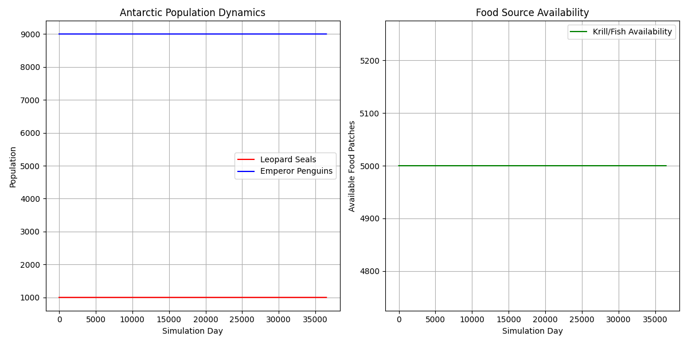

# AgentTorch MCP Server

A Model-Controlled Process (MCP) server that enables natural language-driven simulations of Antarctic ecosystems with emperor penguins and leopard seals.



## Overview

AgentTorch MCP Server provides a web interface for running large-scale agent-based simulations through natural language queries. It uses Claude AI to interpret user requests, extract simulation parameters, and generate analysis of results.

Key features:
- Run simulations with up to 10,000 agents (9,000 emperor penguins and 1,000 leopard seals)
- Natural language interface using Anthropic's Claude
- Real-time visualization of population dynamics
- Detailed simulation logs for tracking ecosystem behavior
- Add custom behaviors through natural language descriptions

## Requirements

- Python 3.9+
- PyTorch 2.0+
- FastAPI
- Anthropic API key

## Installation

1. Clone the repository:
   ```bash
   git clone https://github.com/yourusername/agent-torch-mcp.git
   cd agent-torch-mcp
Install dependencies:
bash
pip install -r requirements.txt
Set your Anthropic API key:
bash
# For Linux/macOS
export ANTHROPIC_API_KEY=your_anthropic_api_key_here

# For Windows (Command Prompt)
set ANTHROPIC_API_KEY=your_anthropic_api_key_here

# For Windows (PowerShell)
$env:ANTHROPIC_API_KEY="your_anthropic_api_key_here"
Create necessary directories:
bash
mkdir -p static/images
mkdir -p static/css
Running the Server
Start the server with:
bash
python app.py
Visit http://localhost:8000 in your browser to access the web interface.

